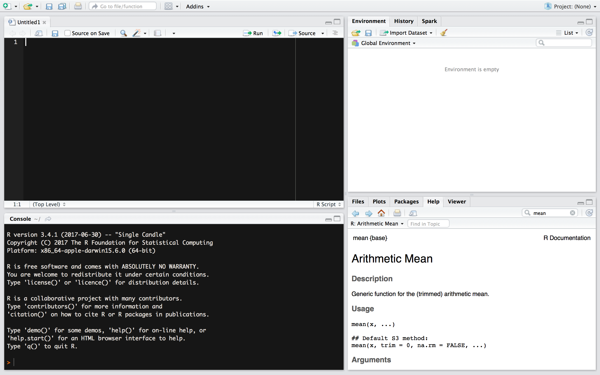

# Tarkvaratööriistad {#tools}

## Installeeri vajalikud programmid

Praktiline kursus eeldab töötavate R, RStudio ja Git programmide olemasolu sinu arvutist. 
Kõik on väga lihtsad installid.

1. Googelda "install R" või mine otse [R allalaadimise veebilehele](https://cran.r-project.org), laadi alla ja installi sobiv versioon.
2. Googelda "install RStudio" või mine otse [RStudio allalaadimise veebilehele](https://www.rstudio.com/products/rstudio/download/), laadi alla ja installi sobiv versioon.
3. Googelda "install git" või mine otse [Git allalaadimise veebilehele](https://git-scm.com/downloads), laadi alla ja installi sobiv versioon.

## Loo GitHubi konto 
GitHub <i class="fa fa-github" aria-hidden="true"></i> on veebipõhine <i class="fa fa-git" aria-hidden="true"></i> versioonikontrolli repositoorium ja veebimajutuse teenus.

- <i class="fa fa-github" aria-hidden="true"></i> konto loomiseks mine lehele https://github.com. Loo endale oma nimega seotud avalik konto. Tulevikule mõeldes vali kasutajanimi hoolikalt. Ära muretse detailide pärast, need on võimalik täita hiljem.

- Loo repo nimega `intro_demo`.
- Lisa repole lühike ja informatiivne kirjeldus. 
- Vali "Public".
- Pane linnuke kasti "Initialize this repository with a README".
- Klikka "Create Repository".

## Loo uus R projekt

> NB! Loo kataloogide nimed ilma tühikuteta. Tühikute asemel kasuta alakriipsu "\_". 

4. Ava RStudio (R ise töötab taustal ja sa ei pea seda kunagi ise avama)
5. Ava RStudio akna (Joonis \@ref(fig:rstudiowindow)) paremalt ülevalt nurgast "Project" menüüst "New Project" dialoog.
6. Ava "New Directory" > "Empty Project" > vali projekti_nimi ja oma failisüsteemi alamkataloog kus see projekti kataloog asuma hakkab. Meie kursusel pane projekti/kataloogi nimeks "rstats2017".

```{r rstudiowindow, echo=FALSE, fig.cap="RStudio konsoolis on neli akent. Üleval vasakul on sinu poolt nimega varustatud koodi ja teksti editor kuhu kirjutad R skripti. Sinna kirjutad oma koodi ja kommentaarid sellele. All vasakul on konsool. Sinna sisestatakse käivitamisel sinu R kood ja sinna trükitakse väljund. Üleval paremal on Environment aken olulise sakiga <i class='fa fa-git' aria-hidden='true'></i>. Seal on näha R-i objektid, mis on sulle töökeskkonnas kättesaadavad ja millega sa saad töötada. <i class='fa fa-git' aria-hidden='true'></i> menüüs on võimalik muutusi vaadata ja 'commit'ida ja <i class='fa fa-github' aria-hidden='true'></i>-ga suhelda. All paremal on paneel mitme sakiga. Files tab töötab nagu failihaldur. Kui sa lood või avad R projekti, siis näidatakse seal vaikimisi sinu töökataloogi. Kui kasutad R projekti, siis ei ole vaja töökataloogi eraldi seadistada. Plots paneelile ilmuvad joonised, mille sa teed. Packages näitab sulle sinu arvutis olevaid R-i pakette ehk raamatukogusid. Help paneeli avanevad help failid (ka need, mida konsooli kaudu otsitakse).", out.width="\\textwidth"}

```

Rohkem infot R projekti loomise kohta leiad RStudio infoleheküljelt: [Using Projects](https://support.rstudio.com/hc/en-us/articles/200526207-Using-Projects).

## Git *Merge* konfliktid
Kollaboreerides üle GitHubi tekivad varem või hiljem konfliktid projekti failide versioonide vahel nn. "merge conflicts", mille lahendamine on väga oluline. 

- Oma repo GitHubi veebilehel muuda/paranda README.md dokumenti ja "Commit"-i seda lühisõnumiga mis sa muutsid/parandasid.
- Seejärel, muuda oma arvutis olevat README.md faili RStudio-s viies sinna sisse mingi teistsuguse muudatuse. Tee "Commit" oma muudatustele.
- Proovi "push"-ida -- sa saad veateate!
- Proovi "pull".
- Lahenda "merge" konflikt ja seejärel "commit" + "push".

Githubi veateadete lugemine ja Google otsing aitavad sind.

## R projekti kataloogi soovitatav minimaalne struktuur

Iga R projekt peab olema täiesti iseseisev (_selfcontained_) ja sisaldama andmeid ja koodi, mis on koos piisavad projektiga seotud arvutuste läbi viimiseks ja raporti genereerimiseks.
Kõik faili _path_-id peavad olema suhtelised. -TAAVI, SEE TULEKS LAHTI KIRJUTADA.


R projekti kataloog peaks sisaldama projekti kirjeldavaid faile, mis nimetatakse 
DESCRIPTION ja README.md. 
**DESCRIPTION** on tavaline tekstifail ja sisaldab projekti metainfot ja infot projekti sõltuvuste kohta, nagu väliste andmesettide asukoht, vajalik tarkvara jne.
**README.md** on markdown formaadis projekti info, sisaldab juhendeid kasutajatele.
Igale GitHubi repole on soovitav koostada README.md, esialgu kasvõi projekti pealkiri ja üks kirjeldav lause. 
README.md ja DESCRIPTION asuvad projekti juurkataloogis.


> Projekti juurkataloogi jäävad ka kõik .Rmd laiendiga teksti ja analüüsi tulemusi sisaldavad failid, millest genereeritakse lõplik raport/dokument.


Suuremad projektid, nagu näiteks teadusartikkel või raamat, võivad sisaldada mitmeid Rmd faile ja võib tekkida kange kisatus need mõnda alamkataloogi tõsta. 
Aga `knitr::knit()`, mis Rmarkdowni markdowniks konverteerib, arvestab, et Rmd fail asub juurkataloogis ja arvestab juurkataloogi suhtes ka failis olevaid _path_-e teistele failidele (näiteks "data/my_data.csv"). 


**data/** kataloog sisaldab faile toorandmetega. 
Need failid peavad olema R-i poolt loetavad ja soovitavalt tekstipõhised, laienditega TXT, CSV, TSV jne. 
Neid faile ei muudeta, ainult loetakse. 
Kogu algandmete töötlus toimub programmaatiliselt.
Suured failid muudavad versioonikontrolli aeglaseks, samuti on suheliselt mõttetu versioonikontroll binaarsete failide korral (MS <i class="fa fa-file-word-o" aria-hidden="true"></i> näiteks), sest diffid pole lihtsalt inimkeeles. 
Github ütleb suurte failide kohta nii: _"GitHub will warn you when pushing files larger than 50 MB. You will not be allowed to push files larger than 100 MB."_

**R/** kataloog sisaldab R skripte. 

**output/** kataloogis on kasutaja poolt genereeritud andmed ja puhastatud andmesetid.

```
project/
|- DESCRIPTION          # project metadata and dependencies
|- README.md            # description of contents and guide to users
|- my_analysis.Rmd      # markdown file containing analysis
|                       # writeup together with R code chunks
|
|- data/                # raw data, not changed once created 
|  +-my_rawdata.csv     # data files in open formats, 
|                       # such as TXT, CSV, TSV etc.
|
|- R/                   # any programmatic code
|  +-my_scripts.R       # R code used to analyse and 
|                       # visualise data
|
|- output/              # generated data
|  +-my_clean_data.rds  # saved R object or cleaned up datasets
```

Kui selles kataloogis olevad skriptid on annoteeritud kasutades Roxygen-i [@roxygen2], siis genereeritakse automaatselt funktsioonide dokumentatsioon kataloogi **man/**. 
Rohkem projekti pakkimise kohta loe värskest preprindist "Packaging data analytical work reproducibly using R" [@marwick2017].

## Pakettide installeerimine {#libs}

R _library_-d ehk paketid sisaldavad ühte või enamat mingit kindlat operatsiooni läbi viivat funktsiooni. **R baaspakett sisaldab juba mitmeid funktsioone.** Kõige esimene sõnum `sum()` help lehel on "sum {base}", mis tähendab, et see funktsioon kuulub nn. baasfunktsioonide hulka.
Need funktsioonid on alati kättesaadavad sest neid sisaldavad raamatukogud laetakse vaikimisi teie töökeskkonda.
Näiteks "base" raamatukogu `r sub("ion:","ioon",tolower(library(help="base")[["info"]][[1]][2]))` sisaldab `r length(library(help="base")[["info"]][[2]])` funktsiooni.
Enamasti on sarnaseid asju tegevad funktsioonid koondatud kokku raamatukogudesse ehk pakettidesse, mis tuleb eraldi R kesksest repositooriumist [CRAN](https://cran.r-project.org) alla laadida ja installeerida. 


Selleks, et installeerida pakett, sisesta järgnev käsurida R konsooli:
```{r, eval=FALSE}
## eg use "ggplot2" as packagename
install.packages("packagename")
```

NB! Kui mõni raamatukogu sel viisil alla ei tule, siis guugeldage selle nime + R ja vaadake instruktsioone installeerimiseks.
Suure tõenäosusega on tegemist mõnes teises repos (näiteks Bioconductor) või ainult GitHubis asuva paketiga.

RStudio võimaldab ka _point-and-click_ stiilis pakettide installeerimist:
```{r, echo=FALSE, fig.cap="RStudio 'Install Packages' dialoogiaken.", out.width="\\textwidth"}
knitr::include_graphics("img/RStudio_package.install.png")
```

> Sa ei saa installeeritud pakette enne kasutada, kui laadid nad töökeskkonda kasutades `library()` funktsiooni.

Peale installeerimist lae pakett oma R sessiooni kasutades `library()` käsku, näiteks:

```{r eval=FALSE}
## Load library/package dplyr
library(dplyr)
```

`library(dplyr)` käsk teeb R sessioonis kasutatavaks kõik "dplyr" paketi funktsioonid.


Näiteks "dplyr" pakett sisaldab `r library(dplyr); length(ls("package:dplyr"))` funktsiooni:

```{r}
library(dplyr)
## let's look at the head of package list
head(ls("package:dplyr"), 20)
```

Konfliktide korral eri pakettide sama nimega funktsioonide vahel saab `::` operaatorit kasutades kutsuda välja/importida funktsiooni spetsiifilisest paketist:
```{r eval=FALSE}
dplyr::select(df, my_var)
```
Sellisel kujul funktsioonide kasutamisel pole vaja imporditavat funktsiooni sisaldavat raamatukogu töökeskkonda laadida.

**Funktsioonide-pakettide help failid RStudio kasutajaliidesest**: Kui te lähete RStudios paremal all olevale "Packages" tabile, siis on võimalik klikkida raamatukogu nimele ja näha selle help-faile, tutooriale ja kõiki selle raamatukogu funktsioone koos nende help failidega.


## R repositooriumid
R pakid on saadaval kolmest põhilisest repositooriumist:

1. __CRAN__ https://cran.r-project.org

```{r eval=FALSE}
install.packages("ggplot2")
```

2. __Bioconductor__ https://www.bioconductor.org

```{r eval=FALSE}
# First run biocLite script fron bioconductor.org
source("https://bioconductor.org/biocLite.R")  
# use 'http' in url if 'https' is unavailable. 
biocLite("edgeR")
```

3. __GitHub__ https://github.com

```{r eval=FALSE}
# following command installs xaringan (presentation ninja) package from GitHub user yihui
devtools::install_github("yihui/xaringan")
```

> NB! antud praktilise kursuse raames tutvume ja kasutame 'tidyverse' metapaketi funktsioone, laadides need iga sessiooni alguses:

```{r eval=FALSE}
# install.packages("tidyverse")
library(tidyverse)
```

Nüüd on teil `tidyverse` pakett arvutis. 
Tegelikult kuuluvad siia raamatukokku omakorda tosinkond raamatukogu --- tidyverse on pisut meta. 
Igal juhul muutuvad selle funktsioonid kättesaadavaks peale seda, kui te need töökeskkonda sisse loete

Veel üks tehniline detail. `library(tidyverse)` käsk ei loe sisse kõiki alam-raamatukogusid, mis selle nime all CRAN-ist alla laaditi. 
Need tuleb vajadusel eraldi ükshaaval sisse lugeda.


> Enamasti kirjutatakse kõik sisse loetavad raamatukogud kohe R scripti algusesse. Siis on ilusti näha, mida hiljem vaja läheb.

