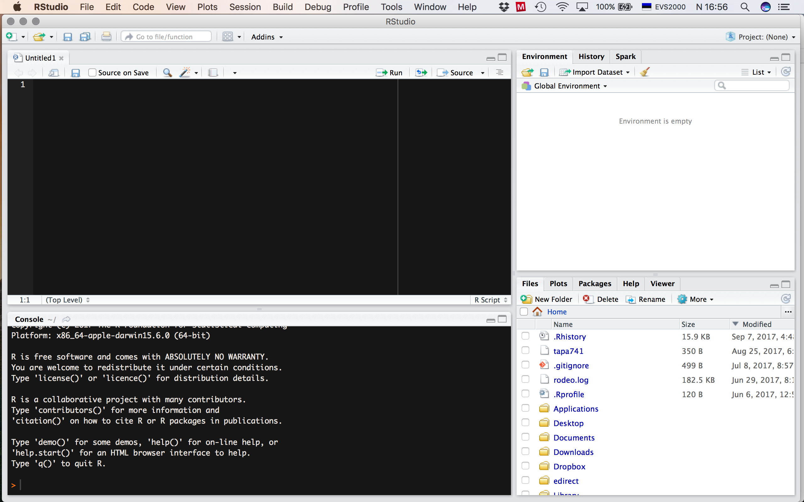

# Tarkvaratööriistad {#tools}

## Installeeri vajalikud programmid

Praktiline kursus eeldab töötavate R, RStudio ja Git programmide olemasolu sinu arvutist. 
Kõik on väga lihtsad installid.

1. Googelda "install R" või mine otse [R allalaadimise veebilehele](https://cran.r-project.org), laadi alla ja installi sobiv versioon.
2. Googelda "install RStudio" või mine otse [RStudio allalaadimise veebilehele](https://www.rstudio.com/products/rstudio/download/), laadi alla ja installi sobiv versioon.
3. Googelda "install git" või mine otse [Git allalaadimise veebilehele](https://git-scm.com/downloads), laadi alla ja installi sobiv versioon.

## Loo GitHubi konto 
GitHub <i class="fa fa-github" aria-hidden="true"></i> on veebipõhine <i class="fa fa-git" aria-hidden="true"></i> versioonikontrolli repositoorium ja veebimajutuse teenus.

- <i class="fa fa-github" aria-hidden="true"></i> konto loomiseks mine lehele https://github.com. Loo endale oma nimega seotud avalik konto. Tulevikule mõeldes vali kasutajanimi hoolikalt. Ära muretse detailide pärast, need on võimalik täita hiljem.

- Loo repo nimega `intro_demo`.
- Lisa repole lühike ja informatiivne kirjeldus. 
- Vali "Public".
- Pane linnuke kasti "Initialize this repository with a README".
- Klikka "Create Repository".

## Loo uus R projekt

> NB! Loo kataloogide nimed ilma tühikuteta. Tühikute asemel kasuta alakriipsu "\_". 

4. Ava RStudio (R ise töötab taustal ja sa ei pea seda kunagi ise avama)
5. Ava RStudio akna (Joonis \@ref(fig:rstudiowindow)) paremalt ülevalt nurgast "Project" menüüst "New Project" dialoog.
6. Ava "New Directory" > "Empty Project" > vali projekti_nimi ja oma failisüsteemi alamkataloog kus see projekti kataloog asuma hakkab. Meie kursusel pane projekti/kataloogi nimeks "rstats2017".

```{r rstudiowindow, echo=FALSE, fig.cap="RStudio konsoolis on neli akent. Üleval vasakul on sinu poolt nimega varustatud koodi ja teksti editor kuhu kirjutad R skripti. Sinna kirjutad oma koodi ja kommentaarid sellele. All vasakul on konsool. Sinna sisestatakse käivitamisel sinu R kood ja sinna trükitakse väljund. Üleval paremal on Environment aken olulise sakiga <i class='fa fa-git' aria-hidden='true'></i>. Seal on näha R-i objektid, mis on sulle töökeskkonnas kättesaadavad ja millega sa saad töötada. <i class='fa fa-git' aria-hidden='true'></i> menüüs on võimalik muutusi vaadata ja 'commit'ida ja <i class='fa fa-github' aria-hidden='true'></i>-ga suhelda. All paremal on paneel mitme sakiga. Files tab töötab nagu failihaldur. Kui sa lood või avad R projekti, siis näidatakse seal vaikimisi sinu töökataloogi. Kui kasutad R projekti, siis ei ole vaja töökataloogi eraldi seadistada. Plots paneelile ilmuvad joonised, mille sa teed. Packages näitab sulle sinu arvutis olevaid R-i pakette ehk raamatukogusid. Help paneeli avanevad help failid (ka need, mida konsooli kaudu otsitakse)."}

```

Rohkem infot R projekti loomise kohta leiad RStudio infoleheküljelt: [Using Projects](https://support.rstudio.com/hc/en-us/articles/200526207-Using-Projects).

## Git *Merge* konfliktid
Kollaboreerides üle GitHubi tekivad varem või hiljem konfliktid projekti failide versioonide vahel nn. "merge conflicts", nende korrektselt lahendama õppimine on väga oluline. 

- Oma repo GitHubi veebilehel muuda/paranda README.md dokumenti ja "Commit"-i seda lühisõnumiga mis sa muutsid/parandasid.
- Seejärel, muuda oma arvutis olevat README.md faili RStudio-s viies sinna sisse mingi teistsuguse muudatuse. Tee "Commit" oma muudatustele.
- Proovi "push"-ida -- sa saad veateate!
- Proovi "pull".
- Lahenda "merge" konflikt ja seejärel "commit" + "push".

Githubi veateadete lugemine ja Google otsing aitavad sind.

## R projekti kataloogi soovitatav minimaalne struktuur

Iga R projekt peab olema täiesti iseseisev (_selfcontained_) ja sisaldama kogu infot, andmeid ja instruktsioone, et projektiga seotud arvutused läbi viia ja raport genereerida.
Kõik faili _path_-id peavad olema suhtelised.


R projekti kataloog peaks sisaldama projekti kirjeldavaid faile, mis nimetatakse 
DESCRIPTION ja README.md. 
**DESCRIPTION** on tavaline tekstifail ja sisaldab projekti metainfot ja infot projekti sõltuvuste kohta, nagu väliste andmesettide asukoht, vajalik tarkvara jne.
**README.md** on markdown formaadis projekti info, sisaldab juhendeid kasutajatele.
Igale GitHubi repole on soovitav koostada README.md, esialgu kasvõi projekti pealkiri ja üks kirjeldav lause. 
README.md ja DESCRIPTION asuvad projekti juurkataloogis.


> Projekti juurkataloogi jäävad ka kõik .Rmd laiendiga teksti ja analüüsi tulemusi sisaldavad failid, millest genereeritakse lõplik raport/dokument.


Suuremad projektid, nagu näiteks teadusartikkel või raamat, võivad sisaldada mitmeid Rmd faile ja võib tekkida kange kisatus need mõnda alamkataloogi tõsta. 
Aga `knitr::knit()`, mis Rmarkdowni markdowniks konverteerib, arvestab, et Rmd fail asub juurkataloogis ja arvestab juurkataloogi suhtes ka failis olevaid _path_-e teistele failidele (näiteks "data/my_data.csv"). 


**data/** kataloog sisaldab faile toorandmetega. 
Need failid peavad olema R-i poolt loetavad ja soovitavalt tekstipõhised, laienditega TXT, CSV, TSV jne. 
Neid faile ei muudeta, ainult loetakse. 
Kogu algandmete töötlus toimub programmaatiliselt

**src/** kataloog sisaldab analüüsi skripte, sealhulgas ka andmetöötluse skripte. 

**lib/** kataloogis on kasutaja poolt tehtud funktsioonide definitsioone sisaldavad R skriptid.

```
project/
|- DESCRIPTION       # project metadata and dependencies
|- README.md         # description of contents and guide to users
|- my_analysis.Rmd   # markdown file containing analysis
|                    # writeup together with R code chunks
|
|- data/             # raw data, not changed once created 
|  +-my_data.csv     # data files in open formats, 
|                    # such as TXT, CSV, TSV etc.
|
|- src/              # any programmatic code
|  +-my_scripts.R    # R code used to analyse and 
|                    # visualise data
|
|- lib/              # user generated functions
|  +-my_functions.R  # R code defining functions
```

On ka teisi konventsioone, näiteks R pakkide puhul paigutatakse kõik R skriptid taaskasutatavate funktsioonidega kataloogi **R/**. 
Kui selles kataloogis olevad skriptid on annoteeritud kasutades Roxygen-i [@roxygen2], siis genereeritakse automaatselt funktsioonide dokumentatsioon kataloogi **man/**. 

