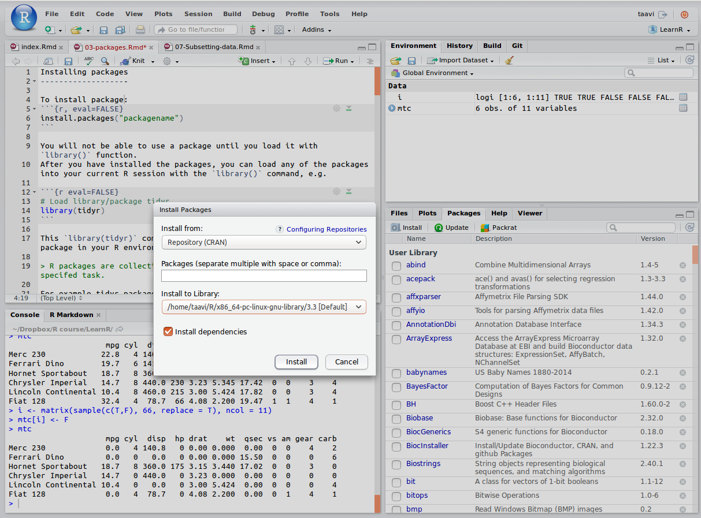

# Pakettide installeerimine

R paketid sisaldavad ühte või enamat mingit kindlat operatsiooni läbi viivat funktsiooni. 
Selleks, et installeerida pakett, sisesta järgnev käsurida R konsooli:
```{r, eval=FALSE}
## eg use "ggplot2" as packagename
install.packages("packagename")
```

RStudio võimaldab ka _point-and-click_ stiilis pakettide installeerimist:
```{r, echo=FALSE, fig.cap="RStudio 'Install Packages' dialoogiaken."}

```

> Sa ei saa installeeritud pakette enne kasutada, kui laadid nad töökeskkonda kasutades `library()` funktsiooni.

Peale installeerimist lae pakett oma R sessiooni kasutades `library()` käsku, näiteks:

```{r eval=FALSE}
## Load library/package tidyr
library(tidyr)
```

`library(tidyr)` käsk teeb R sessioonis kasutatavaks kõik "tidyr" paketi funktsioonid.


Näiteks "tidyr" pakett sisaldab `r library(tidyr); length(ls("package:tidyr"))` funktsiooni:

```{r}
library(tidyr)
ls("package:tidyr")
```


## R repositooriumid
R pakid on saadaval kolmest põhilisest repositooriumist:

1. __CRAN__ https://cran.r-project.org

```{r eval=FALSE}
install.packages("ggplot2")
```

2. __Bioconductor__ https://www.bioconductor.org

```{r eval=FALSE}
# First run biocLite script fron bioconductor.org
source("https://bioconductor.org/biocLite.R")  
# use 'http' in url if 'https' is unavailable. 
biocLite("GenomicRanges", suppressUpdates = TRUE)
```

3. __GitHub__ https://github.com

```{r eval=FALSE}
## Näiteks järgnev käsk installeerib xaringan 
## presentation ninja paketi
devtools::install_github("yihui/xaringan")
```


> NB! antud praktilise kursuse raames tutvume ja kasutame 'tidyverse' metapaketi funktsioone, laadides need iga sessiooni alguses:

```{r eval=FALSE}
## install.packages("tidyverse")
library(tidyverse)
```
