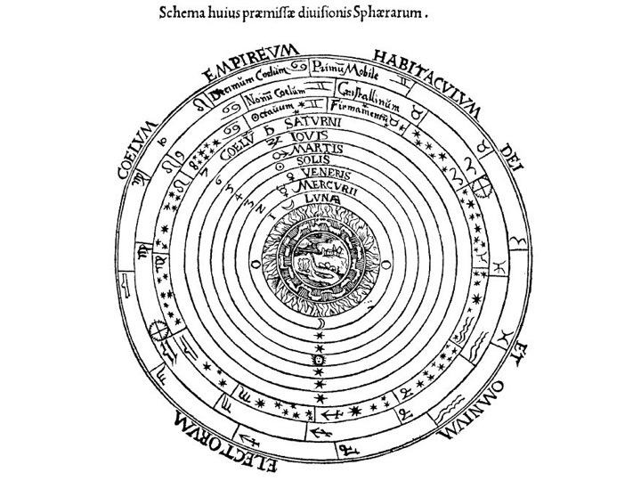
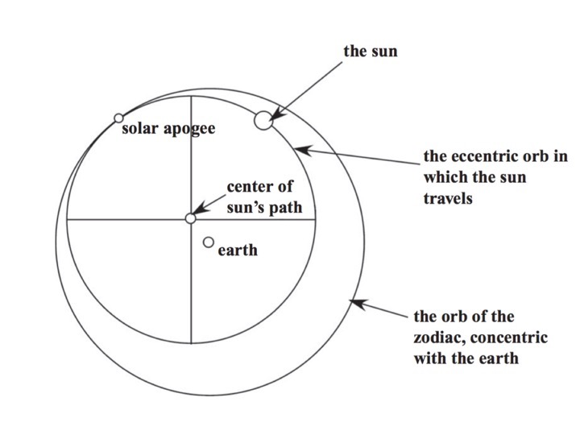
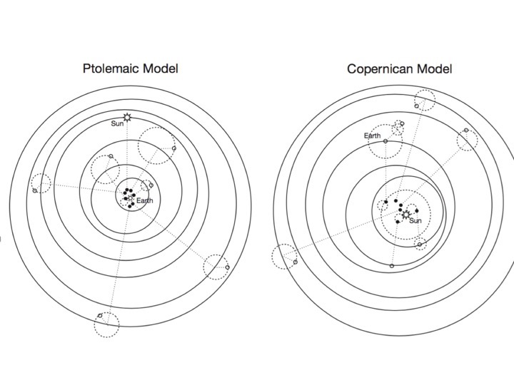

# Statistilised mudelid

```{r, message=FALSE}
library(tidyverse)
library(ggthemes)
library(scatterplot3d)
library(modelr)
library(broom)
```


## Suur ja väike maailm

Kuna maailmas on kõik kõigega seotud, on seda raske otse uurida. Teadus töötab tänu sellele, et teadlased lõikavad reaalsuse väikesteks tükkideks, kasutades tordilabidana teaduslike hüpoteese, ning uurivad seda tükikaupa lootuses, et kui kõik tükid on korralikult läbi nätsutatud, saab sellest taas tordi kokku panna. Tüüpiline bioloogiline hüpotees pakub välja tavakeelse (mitte matemaatilise) seletuse mõnele piiritletud loodusnähtusele. 
  
Näiteks antibiootikume uuritakse keemilise sideme tasemel kasutades orgaanilise keemia meetodeid. Antibiootikumide molekulaarseid märklaudu uuritakse molekulaarbioloogiliste meetoditega, nende toimet uuritakse rakubioloogia ja füsioloogia meetoditega, aga kaasajal on väga olulised ka ökoloogilised, evolutsioonilised, meditsiinilised, põllumajanduslikud, majanduslikud ja psühholoogilised aspektid. Kõigil neil tasanditel on loodud palju hüpoteese, millest kokku moodustub meie teadmine antibiootikumide kohta. Neid väga erinevaid asju, mida me kutsume hüpoteesideks, ühendab see, et neist igaüht võib võrrelda empiiriliste andmetega. Samuti, enamust neist saab kirjeldada matemaatiliste formalismide ehk mudelite abil, ja neid mudeleid saab omakorda võrrelda andmetega. Kuigi erinevate tasemete hüpoteesid on tavakeeles üksteisest väga erinevad, on neid kirjeldavad mudelid sageli matemaatiliselt sarnased.
  
> Kui mudel on teooria lihtsustus, siis teooria on maailma lihtsustus.
  
Mis juhtub, kui teie hüpotees on andmetega kooskõlas? Kas see tähendab, et see hüpotees vastab tõele? Või, et see on tõenäoliselt tõene? Kahjuks on vastus mõlemale küsimusele eitav. Põhjuseks on asjaolu, et enamasti leiab iga nähtuse seletamiseks rohkem kui ühe alternatiivse teadusliku hüpoteesi ning rohkem kui üks üksteist välistav hüpotees võib olla olemasolevate andmetega võrdses kooskõlas. Asja teeb veelgi hullemaks, et teoreetiliselt on võimalik sõnastada lõpmata palju erinevaid teooriaid, mis kõik pakuvad alternatiivseid ja üksteist välistavaid seletusi samale nähtusele. Kuna hüpoteese on lõpmatu hulk, aga andmeid on alalti lõplik hulk, siis saab igas teaduslikus "faktis" kahelda.  
Kunagi ei või kindel olla, et parimad teooriad ei ole täiesti tähelepanuta jäänud ning, et meie poolt kogutud vähesed andmed kajastavad hästi kõiki võimalikke andmeid.

> Ca. 1910 mõtlesid filosoofid Russell ja Moore välja tõe vastavusteooria, mille kohaselt tõest propositsiooni eristab väärast "vastavus" füüsikalisele maailmale. Selle kohaselt on tõesed need laused, mis vastavad asjadele. Ehkki keegi ei oska siiani öelda, mida "vastavus" selles kontekstis ikkagi tähendab, või kuidas seda saavutada, on vastavusteooria senini kõige populaarsem tõeteooria filosoofide hulgas (mis on kõnekas alternatiivide kohta). Samamoodi, kui lausete vastavusest maailmaga, võime rääkida ka võrrandite (ehk mudelite) vastavusest lausetega. Vastavusest lausetaga sellepärast, et mudelid on koostatud teaduslike teooriate, mitte otse maailma, kirjeldusena. Seega ei pea me muretsema mudelite tõeväärtuse pärast. Võib lausa väita, et mudeli tõeväärtusest rääkimine on kohatu.

Teeoria ja mudeli seose kohta selline näide. Meil on hüpotees, mille kohaselt valijad eelistavad demokraatlikus süsteemis kandidaate, kes on ennast juba tõestanud sellega, et saavad hakkama riigi majanduse edendamisega. Seega, kompetentsed poliitikud valitakse tagasi. Sellest hüpoteesist saab tuletada kaks järelmit 1. - majandusel läheb keskmiselt paremini juba tagasi valitud poliitikute all kui esimest korda valitud poliitkute all, keda ei ole veel elektoraadi poolt harvendatud ja 2. - majandusnäitajate varieeruvus on esimesel juhul väiksem, sest kehvemad poliitikud on juba valija poolt valimist eemaldatud (Achen, C. H., & Bartels, L. M. (2016). Democracy for Realists). Esimese järelmi testimiseks kasutati statistilise mudelina aritmeetilist keskmist koos standardveaga ja teise järelmi jaoks standardhälvet. Tulemused olid vastupidised hüpoteesi poolt ennustatutega. Seega: andmed (kas neid on piisavalt? on nad representatiivsed?) --> mudel (kindlasti on siin alternatiivseid võimalusi sama küsimuse modelleerimiseks) --> teooria järelm (sama teooria annab ka teisi järelmeid. Mis juhtub, kui osad neist on andmetega kooskõlas ja teised ei ole?) --> laiem teooria --> järeldus demokraatia toimimise kohta laias maailmas.

## Mudeli väike maailm

Ülalmainitud teadusliku meetodi puudused tingivad, et meie huvides on oma teaduslikke probleeme veel ühe taseme võrra lihtsustada, taandades need statistilisteks probleemideks. Selleks tuletame tavakeelsest teaduslikust teooriast täpselt formuleeritud matemaatilise mudeli ning seejärel asume uurima oma mudelit lootuses, et mudeli kooskõla andmetega ütleb meile midagi teadusliku hüpoteesi kohta. Enamasti töötab selline lähenemine siis, kui mudeli ehitamisel arvestati võimaliku andmeid genereeriva mehhanismiga -- ehk, kui mudeli matemaatiline struktuur koostati teaduslikku hüpoteesi silmas pidades. Mudelid, mis ehitatakse silmas pidades puhtalt matemaatilist sobivust andmetega, ei kipu omama teaduslikku seletusjõudu, kuigi neil võib olla väga hea ennustusjõud. 
  
> Meil on kaks hüpoteesi, A ja B. Juhul kui A on tõene ja B on väär, kas on võimalik, et B on tõele lähemal kui A? Kui A ja B on teineteist välistavad punkthüpoteesid parameetri väärtuse kohta, siis on vastus eitav. Aga mis juhtub, kui A ja B on statistilised mudelid? Näiteks, kui tõde on, et eesti meeste keskmine pikkus on 178.3 cm ja A ütleb, et keskmine pikkus jääb kuhugi 150 cm ja 220 cm vahele ning B ütleb, et see jääb kuhugi 179 cm ja 182 cm vahele, siis on B tõele lähemal selles mõttes, et meil on temast teaduslikus mõttes rohkem kasu. Siit on näha oluline erinevus teadusliku hüpoteesi ja statistilise mudeli vahel: hüpotees on orienteeritud tõele, samal ajal kui mudel on orienteeritud kasule.  
  
Mudeli maailm erineb päris maailmast selle poolest, et mudeli maailmas on kõik sündmused, mis põhimõtteliselt võivad juhtuda, juba ette teada ja üles loendatud (seda sündmuste kogu kutsutakse parameetriruumiks). Tehniliselt on mudeli maailmas üllatused võimatud. 


Lisaks, tõenäosusteooriat, ja eriti Bayesi teoreemi, kasutades on meil garantii, et me suudame mudelis leiduva informatsiooniga ümber käia parimal võimalikul viisil. Kõik see rõõm jääb siiski mudeli piiridesse.
Mudeli eeliseks teooria ees on, et hästi konstrueeritud mudel on lihtsamini mõistetav --- erinevalt vähegi keerulisemast teaduslikust hüpoteesist on mudeli eeldused ja ennustused läbinähtavad ja täpselt formuleeritavad. Mudeli puuduseks on aga, et erinevalt teooriast ei ole mingit võimalust, et mudel vastaks tegelikkusele. Seda sellepärast, et mudel on taotluslikult lihtsustav (erandiks on puhtalt ennustuslikud mudelid, mis on aga enamasti läbinähtamatu struktuuriga). Mudel on kas kasulik või kasutu; teooria on kas tõene või väär. Mudeli ja maailma vahel võib olla kaudne peegeldus, aga mitte kunagi otsene side. Seega, ükski number, mis arvutatakse mudeli raames, ei kandu sama numbrina üle teaduslikku ega päris maailma. Ja kogu statistika (ka mitteparameetriline) toimub mudeli väikses maailmas. Arvud, mida statistika teile pakub, elavad mudeli maailmas; samas kui teie teaduslik huvi on suunatud päris maailmale. Näiteks 95% usaldusintervall ei tähenda, et te peaksite olema 95% kindel, et tõde asub selles intervallis – sageli ei tohiks te seda nii julgelt tõlgendada isegi kitsas mudeli maailmas. 
  
### Näide: Aristoteles, Ptolemaios ja Kopernikus

Aristoteles (384–322 BC) lõi teooria maailma toimimise kohta, mis domineeris haritud eurooplase maailmapilti enam kui 1200 aasta vältel. Tema ühendteooria põhines maailmapildil, mis oli üldtunnustatud juba sajandeid enne Aristotelest ja järgneva 1500 aasta jooksul kahtlesid selles vähesed mõistlikud inimesed. Selle kohaselt asub universumi keskpunktis statsionaarne maakera ning kõik, mida siin leida võib, on tehtud neljast elemendist: maa, vesi, õhk ja tuli. Samas, kogu maailmaruum alates kuu sfäärist on tehtud viiendast elemendist (eeter), mida aga ei leidu maal (nagu nelja elementi ei leidu kuu peal ja sealt edasi). Taevakehad (kuu, päike, planeedid ja kinnistähed) tiirlevad ümber maa kontsentrilistes sfäärides, mille vahel pole vaba ruumi. Seega on kogu liikumine eetri sfäärides ühtlane ja ringikujuline ja see liikumine põhjustab pika põhjus-tagajärg ahela kaudu kõiki liikumisi, mida maapeal kohtame. Kaasa arvatud sündimine, elukäik ja surm. Kõik, mis maapeal huvitavat, ehk kogu liikumine, on algselt põhjustatud esimese liikumise poolt, mille käivitab kõige välimises sfääris paiknev meie jaoks mõistetamatu intellektiga "olend".  

```{r, fig.cap="Keskaegne aristotellik maailm.", fig.align='center',echo=FALSE}

```


Aristotelese suur teooria ühendab kogu maailmapildi alates meie mõistes keemiast ja kosmoloogiast kuni bioloogia, maateaduse ja isegi geograafiani. Sellist ühendteooriat on erakordselt raske ümber lükata, sest seal on kõik kõigega seotud.

 > Aristarchus (c. 310 – c. 230 BC) proovis seda siiski, väites, et tegelikult tiirleb maakera ümber statsionaarse päikese. Ta uskus ka, et kinnistähed on teised päikesed, et universum on palju suurem kui arvati (ehkki kaasaegne seisukoht oli, et universumi mastaabis ei ole maakera suurem kui liivatera) ning, et maakera pöörleb ümber oma telje. Paraku ei suutnud Aristarchuse geotsentriline teooria toetajaid leida, kuna see ei pidanud vastu vaatluslikule testile. Geotsentrilisest teooriast tuleneb nimelt loogilise paratametusena, et tähtedel esineb maalt vaadates parallaks. See tähendab, et kui maakera koos astronoomiga
      teeb poolringi ümber päikese, siis kinnistähe näiv asukoht taevavõlvil
      muutub, sest astronoom vaatleb teda teise nurga alt. Pange oma nimetissõrm
      näost u 10 cm kaugusele, sulgege parem silm, seejärel avage see ning sulgege
      vasak silm ja te näete oma sõrme parallaksi selle näiva asukoha muutusena.
      Mõõtmised ei näidanud aga parallaksi olemasolu (sest maa trajektoori diameeter 
      on palju lühem maa kaugusest tähtedest). Parallaksi suudeti esmest korda mõõta alles 1838, siis kui juba iga koolijüts uskus, et maakera tiirleb ümber päikese!

Ühte Aristotelese kosmoloogia olulist puudust nähti siiski kohe. Nimelt ei suuda Aristoteles seletada, miks osad planeedid teavavõlvil vahest suunda muudavad ja mõnda aega lausa vastupidises suunas liiguvad (retrogressioon). Kuna astronoomiat kasutasid põhiliselt astroloogid, siis põõrati planeetide liikumisele suurt tähelepanu. Lahenduseks ei olnud aga mitte suure teooria ümbertegemine või ümberlükkamine, vaid uue teaduse nõudmine, mis "päästaks fenomenid". Siin tuli appi Ptolemaios (c. AD 100 – c. 170), kes lõi matemaatilise mudeli, kus planeedid mitte lihtsalt ei liigu ringtrajektoori mõõda, vaid samal ajal teevad ka väiksemaid ringe ümber esimese suure ringjoone. Neid väiksemaid ringe kutsutakse epitsükliteks. See mudel suutis planeetide liikumist taevavõlvil piisavalt hästi ennustada, et astroloogide seltskond sellega rahule jäi. 

Ptolemaiosel ja tema järgijatel oli tegelikult mitu erinevat mudelit. Osad neist ei sisaldanud epitsükleid ja maakera ei asunud tema mudelites universumi keskel, vaid oli sellest punktist eemale nihutatud --- nii et päike ei teinud ringe ümber maakera vaid ümber tühja punkti. Kuna leidus epitsüklitega mudel ja ilma epitsükliteta mudel, mis andsid identseid ennustusi, on selge, et Aristotelese teooria ja fenomenide päästmise mudelid on põhimõtteliselt erinevad asjad. Samal ajal, kui Aritoteles **seletas** maailma põhiolemust põhjuslike seoste jadana (mitte matemaatiliselt), **kirjeldas/ennustas** Ptolemaios sellesama maailma käitumist matemaatiliste (mitte põhjuslike) struktuuride abil.

```{r, fig.cap="Ilma epitsükliteta ptolemailine mudel.", fig.align='center',echo=FALSE}

```


Nii tekkis olukord, kus maailma mõistmiseks kasutati Aristotelese ühendteooriat, aga selle kirjeldamiseks ja tuleviku ennustamiseks hoopis ptolemailisi mudeleid, mida keegi päriselt tõeks ei pidanud ja mida hinnati selle järgi, kui hästi need "päästsid fenomene". 

See toob meid Kopernikuse (1473 – 1543) juurde, kes teadusajaloolaste arvates vallandas 17. sajandi teadusliku revolutsiooni, avaldades raamatu, kus ta asetab päikese universumi keskele ja paneb maa selle ümber ringtrajektooril tiirlema. Kas Kopernikus tõrjus sellega kõrvale Aristotelese, Ptolemaiose või mõlemad? Tubdub, et Kopernikus soovis kolmandat, suutis esimest, ning et tolleaegsete lugejate arvates üritas ta teha teist --- ehk välja pakkuda alternatiivi ptolemailistele mudelitele, mis selleks ajaks olid muutunud väga keerukaks (aga ka samavõrra ennustustäpseks). Kuna Kopernikuse raamat läks trükki ajal, mil selle autor oli juba oma surivoodil, kirjutas sellele eessõna üks tema vaimulikust sõber, kes püüdis oodatavat kiriklikku pahameelt leevendada vihjates, et päikese keskele viimine on vaid mudeldamise trikk, millest ei tasu järeldada, et maakera ka tegelikult ümber päikese tiirleb (piibel räägib, kuidas jumal peatas taevavõlvil päikese, mitte maa). Ja kuna eessõna oli anonüümne, eeldasid lugejad muidugi, et selle kirjutas autor. Lisaks, kuigi Kopernikus tõstis päikese keskele, jäi ta planeetide ringikujuliste trajektooride juurde, mis tähendas, et selleks, et tema teooria fenomenide päästmisel hätta ei jääks, oli ta sunnitud maad ja planeete liigutama ümber päikese mõõda epitsükleid. Kokkuvõttes oli Kopernikuse mudel pea-aegu sama keeruline kui Ptolemaiose standardmudel ja selle abil tehtud ennustused planeetide liikumise kohta olid väiksema täpsusega. Seega, ennustava mudelina ei olnud tal suuri eeliseid ptolemailike mudelite ees.

```{r, fig.cap="Ptolemaiose ja Kopernikuse mudelid on üllatavalt sarnased.", fig.align='center',echo=FALSE}

```


> Kopernikuse mudel suutis siiski ennustada mõningaid nähtusi (planeetide näiv
    heledus jõuab maksimumi nende lähimas asukohas maale), mida
      Ptolemaiose mudel ei ennustanud. See ei tähenda, et need fenomenid oleksid
      olnud vastuolus Ptolemaiose mudeliga. Lihtsalt, nende Ptolemaiose mudelisse
      sobitamiseks oli vaja osad mudeli parameetrid fikseerida nii-öelda 
      suvalistele väärtustele. Seega Koperniku mudel töötas nii, nagu see oli, 
      samas kui Ptolemaiose mudel vajas ad hoc tuunimimst.  

Kui vaadata Koperniku produkti teooriana, mitte mudelina, siis oli sellel küll selgeid eeliseid Aristotelese maailmateooria ees. Juba ammu oli nähtud komeete üle taevavõlvi lendamas (mis Aristotelese järgi asusid kinnistähtede muutumatus sfääris), nagu ka supernoova tekkimist ja kadu, ning enam ei olnud kaugel aeg, mil Galileo joonistas oma teleskoobist kraatreid kuu pinnal, näidates, et kuu ei saanud koosneda täiuslikust viiendast elemendist ja et sellel toimusid ilmselt sarnased füüsikalised protsessid kui maal. On usutav, et kui Kopernikus oleks jõudnud oma raamatule ise essõna kirjutada, oleks tema teooria vastuvõtt olnud palju kiirem (ja valulisem). 


## Lineaarsed mudelid 
  
Oletame, et me mõõtsime N inimese pikkuse cm-s ja kaalu kg-s ning meid huvitab, kuidas inimeste pikkus sõltub nende kaalust. Lihtsaim mudel pikkuse sõltuvusest kaalust on pikkus = kaal (formaliseeritult: y = x) ja see mudel ennustab, et kui Johni kaal = 80 kg, siis John on 80 cm pikkune. siin on pikkus muutuja, mille väärtust ennustatakse ja kaal muutuja, mille väärtuste põhjal ennustatakse pikkusi. Selle mudeli saame graafiliselt kujutada nii:
 
```{r fig.height=3, fig.width=3}
x <- 0:100 #y = kaal
y <- x # x = pikkus 
plot(y ~ x, 
     type = "l", 
     xlab = "weight in kg", 
     ylab = "heigth in cm")
```


Mudeli keeles tähistame me seda, mida me ennustame (antud juhul pikkus) Y-ga ja seda, mille väärtuse põhjal me ennustame (antud juhul kaal) X-ga. Seega sirge mudeli matemaatiline formalism on Y = X. 

See on äärmiselt jäik mudel: sirge, mille asukoht on rangelt fikseeritud. Sirge lõikab y telge alati 0-s (mudeli keeles: sirge intercept ehk lõikepunkt Y teljel = 0) ja tema tõusunurk saab olla ainult 45 kraadi (mudeli keeles: mudeli slope ehk tõus = 1). Selle mudeli jäikus tuleneb sellest, et temas ei ole parameetreid, mille väärtusi me saaksime vabalt muuta ehk tuunida.  

Mis juhtub, kui me lisame mudelisse konstandi, mille liidame x-i väärtustele? 

*y = a + x*

See konstant on mudeli parameeter, mille väärtuse võime vabalt valida. Järgnevalt anname talle väärtuse 30 (ilma konkreetse põhjuseta).

```{r fig.height=3, fig.width=3}
x <- 0:100 
a <- 30
y <- a + x 
plot(y ~ x, 
     xlim = c(0, 100), 
     ylim = c(0, 150), 
     col = "red",
     type = "l")
abline(c(0, 1), lty = 2)
```


Meie konstant a määrab *y* väärtuse, kui *x = 0*, ehk sirge lõikepunkti *y* teljel. 
Teisisõnu, a = mudeli intercept

Mis juhtub, kui me mitte ei liida, vaid korrutame *x*-i konstandiga? 

*y =  bx*

Jällegi, me anname mudeli parameetrile b suvalise väärtuse, 3.

```{r fig.height=3, fig.width=3}
x <- 0:200 #y = kaal
b <- 3
y <- b*x # x = pikkus 
plot(y~x, 
     xlim=c(0, 100), 
     ylim=c(0, 100), 
     col="red",
     type="l")
abline(c(0,1), lty=2)
```

Nüüd muutub sirge tõusunurk, ehk kui palju me ootame *y*-t muutumas, kui *x* muutub näiteks ühe ühiku võrra. Kui b = 3, siis *x*-i tõustes ühe ühiku võrra suureneb *y* kolme ühiku võrra. Proovi järgi, mis juhtub, kui b = -3.

Selleks, et sirget kahes dimensioonis vabalt liigutada, piisab kui me kombineerime eelnevad näited ühte: 

*y = a + bx* 

Selleks lisame mudelisse kaks parameetrit, intercept (a) ja tõus (b). Kui *a = 0* ja *b = 1*, saame me eelpool kirjeldatud mudeli *y = x*. Kui *a = 102*, siis sirge lõikab *y* telge väärtusel 102. Kui *b = 0.8*, siis *x*-i tõustes 1 ühiku võrra tõuseb *y*-i väärtus 0.8 ühiku võrra. Kui *a = 100* ja *b = 0*, siis saame sirge, mis on paraleelne x-teljega ja lõikab y-telge väärtusel 100. Seega, Teades a ja b väärtusi ning omistades x-le suvalise meid huvitava väärtuse, saab ennustada y-i keskmist väärtust sellel x-i väärtusel. Näiteks, olgu andmete vastu fititud mudel: 

pikkus(cm) = 102 + 0.8 * kaal(kg) ehk 

*y = 102 + 0.8x*. 

Omistades nüüd kaalule väärtuse 80 kg, tuleb mudeli poolt ennustatud keskmine pikkus 102 + 0.8 * 80 = 166 cm. Iga kg lisakaalu ennustab mudeli kohaselt 0.8 cm võrra suuremat pikkust.


```{r fig.height=3, fig.width=3}
a <- 102
b <- 0.8
x <-  0:100 
y <-  a + b * x
plot(y ~ x, 
     type = "l", 
     xlab = "weight in kg", 
     ylab = "heigth in cm", 
     ylim = c(50, 200))
```

See mudel ennustab, et 0 kaalu juures on pikku 102 cm, mis on rumal, aga mudelite puhul tavaline, olukord. Me tuunime mudelit andmete peal, mis ei sisalda 0-kaalu. Meie valimiandmed ei peegelda täpselt inimpopulatsiooni. Sirge mudel ei peegelda täpselt pikkuse-kaalu suhteid vahemikus, kus meil on reaalseid kaaluandmeid; ja ta teeb seda veelgi vähem seal, kus meil mõõdetud kaalusid ei ole. Seega pole mõtet imestada, miks mudeli intercept meie üle irvitab.  

Kahe parameetriga sirge mudel ongi see, mida me fitime kahedimensiooniliste andmetega.
Näiteks nii:
```{r}
# fit a linear model and name the model object as m1
m1 <- lm(Sepal.Length ~ Petal.Length, iris)
# make a scatter plot, colored by the var called "Species"
plot(iris$Sepal.Length ~ iris$Petal.Length, col = iris$Species)
# draw the fitted regression line from m1
abline(m1)
```

Mudeli fittimine tähendab siin lihtsalt, et sirge on 2D ruumi asetatud nii, et see oleks võimalikult lähedal kõikidele punktidele.

> oletame, et meil on n andmepunkti ja et me fitime neile sirge. Nüüd plotime fititud sirge koos punktidega ja tõmbame igast punktist mudelsirgeni joone, mis on paraleelne y-teljega. Seejärel mõõdame nende n joone pikkused. Olgu need pikkused a, b, ... i. lm() funktsioon fitib sirge niimoodi, et summa a^2^ + b^2^ + ... i^2^ oleks minimaalne. Seda kutsutakse vähimruutude meetodiks.

Fititud koefitsientide väärtused saame nii
```{r}
coef(m1) 
```

Siin a = (Intercept) ehk `r round(coef(m1)[1], 2)` ja b = Petal.Length ehk `r round(coef(m1)[2], 2)`.

**Ennustus lineaarsest mudelist**

Anname x-le rea väärtusi, et ennustada y keskmisi väärtusi nendel x-i väärtustel. 
Siin me ennustame y (Sepal_length) keskväärtusi erinevatel x-i (Petal_length) väärtustel, mitte individuaalseid Sepal_length väärtusi. Me kasutame selleks deterministlikku mudelit kujul Sepal_length =  a + b*Petal_length. Hiljem õpime ka bayesiaanlike meetoditega individuaalseid Sepal_length-e ennustama. 

Järgnev kood on sisuliselt sama, millega me üle-eelmisel plotil joonistasime mudeli y = a + bx. Me fikseerime mudeli koefitsiendid fititud irise mudeli omadega ja anname Petal_length muutujale 10 erinevat väärtust originaalse muutuja mõõtmisvahemikus. Aga sama hästi võiksime ekstrapoleerida ja küsida, mis on oodatav Sepal_length, kui Petal_length on 100 cm? Loll küsimus, aga mudel ei tea seda. Proovi seda kodus. 

```{r}
Petal_length <- seq(min(iris$Petal.Length), 
                    max(iris$Petal.Length), 
                    length.out = 10)
a <- coef(m1)[1]
b <- coef(m1)[2]

Sepal_length <-  a + b*Petal_length

plot(Sepal_length~Petal_length, type="b")
```

Siin ennustasime 10 y väärtust 10-l x-i väärtusel.


### Neli mõistet 

Mudelis *y = a + bx* on *x* ja *y* muutujad, ning *a* ja *b* on parameetrid. Muutujate väärtused fikseeritakse andmete poolt, parameetrid fititakse andmete põhjal. Fititud mudel ennustab igale *x*-i väärtusele vastava kõige tõenäolisema *y* väärtuse (*y* keskväärtuse sellel *x*-i väärtusel).
 
 > Y - mida me ennustame (dependent variable, predicted variable)
 
 > X - mille põhjal me ennustame (independent variable, predictor)
 
 > muutuja (variable) - iga asi, mida me valimis mõõdame (X ja Y on kaks muutujat). Muutujal on sama palju fikseeritud väärtusi kui meil on selle muutuja kohta mõõtmisandmeid.
 
 > parameeter (parameter) - mudeli koefitsient, millele võib omistada suvalisi väärtusi. Parameetreid tuunides fitime mudeli võimalikult hästi sobituma andmetega.
 
Mudel on matemaatilise formalism, mis püüab kirjeldada füüsikalist protsessi.
Statistilise mudeli struktuuris on komponent, mis kirjeldab ideaalseid ennustusi (nn protsessi mudel) ja eraldi veakomponent (ehk veamudel), mis kirjeldab looduse varieeruvust nende ideaalsete ennustuste ümber. Mudeli koostisosad on (i) muutuja, mille väärtusi ennustatakse, (ii), muutuja(d), mille väärtuste põhjal ennustatakse, (iii) parameetrid, mille väärtused fititakse ii põhjal ja (iv) konstandid.  

### Mudeli fittimine

Mudelid sisaldavad (1) matemaatilisi struktuure, mis määravad mudeli tüübi ning (2) parameetreid, mida saab andmete põhjal tuunida, niiviisi täpsustades mudeli kuju. 

Seda tuunimist nimetatakse mudeli fittimiseks. Mudelit fittides on eesmärk saavutada antud tüüpi mudeli maksimaalne sobivus andmetega. Näiteks võrrand *y = a + bx* määrab mudeli, kus *y = x* on on see struktuur, mis tagab, et mudeli tüüp on sirge, ning *a* ja *b* on parameetrid, mis määravad sirge asendi. Seevastu struktuur *y = x + x^2^* tagab, et mudeli *y = a + b~1~x + b~2~x^2^*  tüüp on parabool, ning parameetrite *a*, *b~1~* ja *b~2* väärtused määravad selle parabooli täpse kuju. Ja nii edasi. 

  > lineraarse mudeli parima sobivuse andmetega saab tagada kahel erineval viisil: 
    (i) vähimruutude meetod mõõdab y telje suunaliselt iga andmepunkti kauguse mudeli
    ennustusest, võtab selle kauguse ruutu, summeerib kauguste ruudud ning leiab sirge 
    asendi, mille korral see summa on minimaalne; 
    (ii) Bayesi teoreem annab väheinformatiivse priori korral praktiliselt sama fiti. 
  
 Hea mudel on 
 
 (1) võimalikult lihtsa struktuuriga, mille põhjal on veel võimalik teha järeldusi protsessi kohta, mis genereeris mudeli fittimiseks kasutatud andmeid; 
 
 (2) sobitub piisavalt hästi andmetega (eriti uute andmetega, mida ei kasutatud selle mudeli fittimiseks), et olla relevantne andmeid genereeriva protsessi kirjeldus; 
 
 (3) genereerib usutavaid simuleeritud andmeid.
 
 Sageli fititkse samade andmetega mitu erinevat tüüpi mudelit ja püütakse otsustada, milline neist vastab kõige paremini eeltoodud tingimustele. Näiteks, kui sirge suudab kaalu järgi pikkust ennustada paremini kui parabool, siis on sirge mudel paremas kooskõlas teadusliku hüpoteesiga, mis annaks mehhanismi protsessile, mille käigus kilode lisandumine viiks laias kaaluvahemikus inimeste pikkuse kasvule ilma, et pikkuse kasvu tempo kaalu tõustes langeks. 
 
 See, et teie andmed sobivad hästi mingi mudeliga, ei tähenda automaatselt, et see fakt oleks teaduslikult huvitav. Mudeli parameetrid on mõtekad mudeli matemaatilise kirjelduse kontekstis, aga mitte tingimata suure maailma põhjusliku seletamise kontekstis. Siiski, kui mudeli matemaatiline struktuur loodi andmeid genreeeriva loodusliku protsessi olemust silmas pidades, võib mudeli koefitsientide uurimisest selguda olulisi tõsiasju suure maailma kohta. 
 
 > Mudeli fittimine: X ja Y saavad oma väärtused otse andmetest; parameetrid võivad omandada ükskõik millise väärtuse.
 
 > Fititud mudelist ennustamine: X-le saab omistada ükskõik millise väärtuse; parameetrite väärtused on fikseeritud; Y väärtus arvutatakse mudelist.
  
####Üle- ja alafittimine
  
  Osad mudelite tüübid on vähem paindlikud kui teised (parameetreid tuunides on neil vähem liikumisruumi). Kuigi sellised mudelid sobituvad halvemini andmetega, võivad need  ikkagi paremini kui mõni paindlikum mudel välja tuua andmete peidetud olemuse. Mudeldamine eeldab, et me usume, et meie andmetes leidub nii müra (mida mudel võiks ignoreerida), kui signaal (mida mudel püüab tabada). Kuna mudeli jaoks näeb müra samamoodi välja, kui signaal, on iga mudel kompromiss üle- ja alafittimise vahel. Me lihtsalt loodame, et meie mudel on piisavalt jäik, et mitte liiga palju müra modelleerida ja samas piisavalt paindlik, et piisaval määral signaali tabada.
  
  Üks kõige jäigemaid mudeleid on sirge, mis tähendab, et sirge mudel on suure tõenäosusega alafittitud. Keera sirget kuipalju tahad, ikka ei sobitu ta enamiku andmekogudega. Ja need vähesed andmekogud, mis sirge mudeliga sobivad, on genereeritud teatud tüüpi lineaarsete protsesside poolt. Sirge on seega üks kõige paremini tõlgendatavaid mudeleid. Teises äärmuses on polünoomsed mudelid, mis on väga paindlikud, mida on väga raske tõlgendada ja mille puhul esineb suur mudeli ülefittimise oht. Ülefititud mudel järgib nii täpselt valimiandmeid, et sobitub hästi valimis leiduva juhusliku müraga ning seetõttu sobitub halvasti järgmise valimiga samast populatsioonist (igal valimil on oma juhuslik müra). Üldiselt, mida rohkem on mudelis tuunitavaid parameetreid, seda paindlikum on mudel, seda kergem on seda valimiandmetega sobitada ja seda raskem on seda tõlgendada. Veelgi enam, alati on võimalik konstrueerida mudel, mis sobitub täiuslikult kõikide andmepunktidega (selle mudeli parameetrite arv = N). Selline mudel on täpselt sama informatiivne kui andmed, mille põhjal see fititi --- ja täiesti kasutu.

(ref:polymods) __Kasvava paindlikusega polünoomsed mudelid.__ mod_e1 on sirge võrrand y = a + b~1~x (2 parameetrit: a ja b~1~), mod_e2 on lihtsaim võimalik polünoom: y= a + b~1~x + b~2~x^2 (3 parameetrit), ..., mod_e5: y= a + b~1~x + b~2~x^2 + b~3~x^3 + b4x^4 + b5x^5 (6 parameetrit). mod_e5 vastab täpselt andmepunktidele (N = 6).
  
```{r polymods, fig.cap="(ref:polymods)", fig.height=3, fig.width=6}
dfr <- tibble(x = c(2, 3, 2.2, 5, 7, 8), 
             y = c(8, 5, 9, 10, 11, 10.1))
mod_e1 <- lm(y ~ x, data = dfr)
mod_e2 <- lm(y ~ poly(x, 2), data = dfr)
mod_e3 <- lm(y ~ poly(x, 3), data = dfr)
mod_e4 <- lm(y ~ poly(x, 4), data = dfr)
mod_e5 <- lm(y ~ poly(x, 5), data = dfr)

dfr %>%
  gather_predictions(mod_e1, mod_e2, mod_e3, mod_e4, mod_e5) %>% 
  ggplot(aes(x, pred, colour = model)) +
  geom_line() +
  geom_point(aes(x, y), color = "black", size = 2) +
  theme(axis.title = element_blank())
```

Vähimruutude meetodil fititud mudeleid saame võrrelda AIC-i näitaja järgi. AIC  - Akaike Informatsiooni Kriteerium - vaatab mudeli sobivust andmetega ja mudeli parameetrite arvu. 
Väikseim AIC tähitab parimat fitti väikseima parameetrite arvu juures (kompromissi) ja väikseima AIC-ga mudel on eelistatuim mudel. Aga seda ainult võrreldud mudelite hulgas. AIC-i absoluutväärtus ei loe - see on suhteline näitaja.
```{r}
AIC(mod_e1, mod_e2, mod_e3, mod_e4, mod_e5)
```

AIC näitab, et parim mudel on mod_e4. Aga kas see on ka kõige kasulikum mudel? Mis siis, kui 3-s andmepunkt on andmesisestaja näpuviga?


    Ülefittimise vältimiseks kasutavad Bayesi mudelid informatiivseid prioreid, 
    mis välistavad ekstreemsed parameetriväärtused. 
    Vt http://elevanth.org/blog/2017/08/22/there-is-always-prior-information/ 


### kaks lineaarse mudeli laiendust. 

#### mitme sõltumatu prediktoriga mudel

Esiteks vaatame mudelit, kus on mitu prediktorit x~1~, x~2~, ... xn, mis on additiivse mõjuga. See tähendab, et me liidame nende mõjud, mis omakorda tähendab, et me usume, et x~1~...xn mõjud y-i väärtusele on üksteisest sõltumatud. Mudel on siis kujul 

*y = a + b~1~x~1~ + b~2~x~2~ + ... + bnxn*


> mitme prediktoriga mudeli iga prediktori tõus (beta koefitsient) ütleb, mitme ühiku võrra ennustab mudel y muutumist juhul kui see prediktor muutub ühe ühiku võrra ja kõik teised prediktorid ei muutu üldse. Seega pole teiste (kollapseeritud) prediktorite absoluutväärtus ennustusel oluline.


Kui meie andmed on mõõdetud 3D-s ja me tahame ennnustada ühe muutuja väärtust kahe teise muutuja väärtuste põhjal (meil on 2 prediktorit), siis tuleb meie 3 parameetriga lineaarne regressioonimudel tasapinna kujul. Kui meil on 4 prediktoriga mudel, siis me liigume 4-mõõtmelisse ruumi, jne. 3D ruumi on veel võimalik mõistlikult plottida.

```{r}
library(scatterplot3d)  
# prepare a df of 3 cols: 
# Sepal.Length -- Sepal.Width -- Petal.Length (x -- y -- z)
iris1 <- iris[, 1:3]
s3d <- scatterplot3d(iris1, angle = 55, scale.y = 0.7, pch = 20, 
                     col.axis = "blue", col.grid = "lightblue" )
my.lm <- lm(Sepal.Width ~ Sepal.Length + Petal.Length, data = iris1)
s3d$plane3d(my.lm, lty.box = "solid")
```

Seda mudelit saab kaeda 2D ruumis, kui kollapseerida kolmas mõõde konstandile. 

```{r}
m1 <- lm(Sepal.Width ~ Sepal.Length + Petal.Length, data = iris)
plot(iris$Sepal.Width ~ iris$Sepal.Length, ylim = c(2, 8), col = iris$Species)
abline(m1)
```

Enam ei läbi sirge punkte, nagu ta seda 3D ruumis tegi.

Võrlduseks ühe prediktoriga mudel
```{r}
m <- lm(Sepal.Width ~ Sepal.Length, data = iris)
plot(iris$Sepal.Width ~ iris$Sepal.Length, ylim = c(2, 8), col = iris$Species)
abline(m)
```


Nõnda võrdleme kahe mudeli koefitsiente

```{r}
coef(m)
coef(m1)
```

Nagu näha, mudeli m b~1~ koefitsient erineb oluliselt mudeli m1 vastavast koefitsiendist.

Kumb mudel on siis parem? AIC-i järgi on m1 kõvasti parem, kui m.
```{r}
AIC(m, m1)
```

**Ennustused sõltumatute prediktoritega mudelist**

Siin on idee kasutada fititud mudeli struktuuri enustamaks y keskmisi väärtusi erinevatel x~1~ ja x~2~ väärtustel. Kuna mudel on fititud, on parameetrite väärtused fikseeritud. 

```{r fig.height=3, fig.width=3}
Sepal_length <- seq(min(iris$Sepal.Length), 
                    max(iris$Sepal.Length), 
                    length.out = 10) 
Petal_length <-  mean(iris$Petal.Length)
a <- coef(m1)[1]
b1 <- coef(m1)[2]
b2 <- coef(m1)[3]
Sepal_width <- a + b1 * Sepal_length + b2 * Petal_length
plot(Sepal_width ~ Sepal_length, 
     type = "b",
     ylim = c(0, 5),
     col = "red")
abline(c(coef(m)[1], coef(m)[2]), lty = 2) # prediction from the single predictor model
```


Nüüd joonistame 3D pildi olukorrast, kus nii *x~1~* kui *x~2~* omandavad rea väärtusi. Mudeli ennustus on ikkagi sirge kujul -- mis sest, et 3D ruumis.

```{r}
Sepal_length <- seq(min(iris$Sepal.Length), 
                     max(iris$Sepal.Length), 
                     length.out = 10) 
Petal_length <- seq(min(iris$Petal.Length), 
                     max(iris$Petal.Length), 
                     length.out = 10) 
a <- coef(m1)[1]
b1 <- coef(m1)[2]
b2 <- coef(m1)[3]
Sepal_width <- a + b1 * Sepal_length + b2 * Petal_length
df <- data.frame(Sepal_width = Sepal_width, 
                 Sepal_length = Sepal_length, 
                 Petal_length = Petal_length)
scatterplot3d(df$Sepal_length,
              df$Petal_length,
              df$Sepal_width,
              col.axis = "blue", 
              col.grid = "lightblue", 
              type = "l", lwd = 2)
```


### Interaktsioonimudel - ühe prediktori mõju sõltub teise prediktori väärtusest

*y = a + b~1~x~1~ + b~2~x~2~ + b~3~x~1~x~2~*

Interaktsioonimudeli koefitsientide tõlgendamine on keerulisem. b~1~ on otse tõlgendatav ainult siis, kui x~2~=0 (ja b~2~ ainult siis, kui x~1~=0).  Hiljem õpime selliseid mudeleid graafiliselt tõlgendama. Mudeli koefitsientide otse tõlgendamine ei ole siin sageli perspektiivikas.

> Interaktsioonimudelis sõltub x~1~ mõju tugevus y-le x~2~ väärtusest. Selle sõltuvuse määra kirjeldab b~3~ (x~1~ & x~2~ interaktsiooni tugevus). Samamoodi ja sümmeetriliselt erineb ka x~2~ mõju erinevatel x~1~ väärtustel. Ainult siis, kui x~2~ = 0, ennustab x~1~ tõus 1 ühiku võrra y muutust b~1~ ühiku võrra.

Interaktsioonimudeli 2D avaldus on kurvatuuriga tasapind, kusjuures kurvatuuri määrab b~3~. 

Interaktsiooniga mudel on AIC-i järgi pisut vähem eelistatud võrreldes m1-ga. Seega, eriti lihtsuse huvides, eelistame m1-e.
```{r}
m2 <- lm(Sepal.Width~Sepal.Length + 
           Petal.Length + 
           Sepal.Length*Petal.Length, data = iris)
AIC(m, m1, m2)
```


**ennustused interaktsioonimudelist**  

Kõigepealt anname rea väärtusi x~1~-le ja hoiame x~2~ konstantsena. 

```{r}
Sepal_length <- seq(min(iris$Sepal.Length), 
                     max(iris$Sepal.Length), 
                     length.out = 100) 
Petal_length <- mean(iris$Petal.Length)

a <- coef(m2)[1]
b1 <- coef(m2)[2]
b2 <- coef(m2)[3]
b3 <- coef(m2)[4]

Sepal_width <-   a + b1 * Sepal_length + 
  b2 * Petal_length + 
  b3 * Sepal_length * Petal_length

plot(Sepal_width ~ Sepal_length, type = "l", ylim = c(2, 6))
abline(m1, lty = 2)
```

Tulemuseks on sirge, mis on paraleelne ilma interaktsioonita mudeli ennustusele (katkendjoon)


Nagu näha, korrutamistehe viib selleni, et interaktsioonimudeli tõus erineb ilma interaktsioonita mudeli tõusust. 

Kui aga interaktsioonimudel plottida välja 3D-s üle paljude x~1~ ja x~2~ väärtuste, saame me regressioonikurvi (mitte sirge), kus b~3~ annab kurvatuuri.

```{r}
Sepal_length <- seq(min(iris$Sepal.Length), 
                     max(iris$Sepal.Length), 
                     length.out = 100) 
Petal_length <- seq(min(iris$Petal.Length), 
                     max(iris$Petal.Length), 
                     length.out = 100) 
a <- coef(m2)[1]
b1 <- coef(m2)[2]
b2 <- coef(m2)[3]
b3 <- coef(m2)[4]

Sepal_width <- a + b1 * Sepal_length + 
  b2 * Petal_length + 
  b3 * Sepal_length * Petal_length

df <- data.frame(Sepal_width = Sepal_width, 
                 Sepal_length = Sepal_length, 
                 Petal_length = Petal_length)
scatterplot3d(df$Sepal_length,
              df$Petal_length,
              df$Sepal_width,
              col.axis = "blue", 
              col.grid = "lightblue", 
              type = "l", lwd = 2)
```

Vau! See on alles ennustus!
