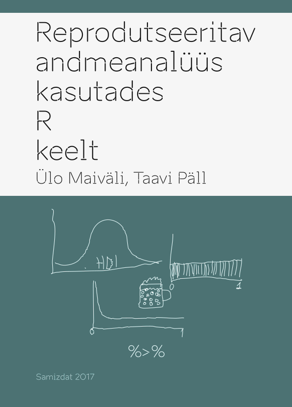

--- 
title: "Reprodutseeritav andmeanalüüs kasutades R keelt"
author: "Taavi Päll, Ülo Maiväli"
date: "2018-01-09"
site: bookdown::bookdown_site
output: bookdown::gitbook
documentclass: book
bibliography: [book.bib, packages.bib]
biblio-style: apalike
link-citations: yes
colorlinks: yes
github-repo: rstats-tartu/lectures
description: "Praktilise kursuse 'Reprodutseeritav andmeanalüüs R keeles' materjalid."
cover-image: img/cover.png
---

# Haara kannel, Vanemuine! {-}

